# Heart Disease Risk Prediction with PySpark ML

## 🏥 Project Overview

This project implements a comprehensive machine learning pipeline using Apache PySpark to predict cardiovascular disease risk based on patient medical data. The system analyzes routine medical examination data (age, blood pressure, cholesterol, etc.) to provide early risk assessment and support clinical decision-making.

**Goal**: Develop predictive models to identify patients at risk of cardiovascular disease using scalable big data technologies.

## 🎯 Project Objectives

- **Data Processing**: Clean and prepare patient medical data
- **Exploratory Data Analysis**: Perform comprehensive statistical analysis and visualization
- **Feature Engineering**: Transform categorical variables and create meaningful features
- **Model Development**: Train and evaluate multiple machine learning algorithms
- **Performance Assessment**: Compare models using standard classification metrics
- **Model Interpretability**: Identify key risk factors influencing predictions
- **Production Deployment**: Save trained models for future predictions

## 👥 User Stories

| Role | Requirement |
|------|-------------|
| **Health Analyst** | I want to understand which factors most influence cardiovascular risk |
| **Medical Doctor/Researcher** | I need a reliable model to predict risk for new patients |
| **Data Scientist** | I want to test multiple models and compare their performance |

## 📊 Dataset Description

The dataset contains medical examination data with the following features:

### Numerical Features
- **Age**: Patient age (29-77 years)
- **Blood_Pressure**: Resting blood pressure (94-200 mmHg)  
- **Cholesterol**: Serum cholesterol level (126-564 mg/dl)
- **Heart_Rate**: Maximum heart rate achieved (71-202 bpm)
- **ECG_Angina**: ST depression induced by exercise relative to rest

### Categorical Features
- **Sex**: Gender (Male/Female)
- **Angina**: Chest pain type (Stable angina, Unstable angina, Other pains, Asymptomatic)
- **Glycemia**: Fasting blood sugar level (Less than 120 mg/dl, More than 120 mg/dl)
- **ECG**: Resting electrocardiographic results (Normal, Anomalies, Hypertrophy)
- **Angina_After_Sport**: Exercise-induced angina (Yes/No)
- **ECG_Slope**: Peak exercise ST segment slope (Rising, Stable, Falling)
- **Fluoroscopy**: Number of major vessels colored by fluoroscopy (No anomaly, Low, Medium, High)
- **Thalassemia**: Blood disorder status (No, Under control, Unstable)

### Target Variable
- **Disease**: Presence of heart disease (Yes/No)

**Dataset Statistics**:
- Total samples: 303 (297 after cleaning)
- Missing values: 6 samples removed
- Class distribution: ~54% positive cases

## 🔧 Technical Architecture

### Technology Stack
- **PySpark 3.5.1**: Distributed computing and ML framework
- **Google Colab**: Cloud-based development environment
- **Python 3.10**: Programming language
- **Matplotlib/Seaborn**: Data visualization
- **Pandas**: Data manipulation and analysis

### Pipeline Architecture

```
Raw Data → Data Cleaning → Feature Engineering → Model Training → Evaluation → Production
    ↓            ↓              ↓                    ↓             ↓           ↓
   CSV    Remove nulls    String Indexing     3 ML Algorithms  Metrics   Saved Models
 (303 rows)  (297 rows)   + Vector Assembly   (LR, RF, GBT)   Analysis   (Pipeline)
```

## 🔄 Project Workflows

### 🔬 Data Processing Workflow

```mermaid
graph TD
    A["📊 Raw Dataset<br/>heart-disease.csv"] --> B["🔍 Data Inspection"]
    B --> C["📋 Schema Validation"]
    C --> D["🧹 Data Cleaning"]
    D --> E["📈 Exploratory Analysis"]
    E --> F["🔧 Feature Engineering"]
    F --> G["✅ Data Validation"]
    G --> H["💾 Processed Dataset"]
    
    D --> D1["Remove Missing Values (?)"]
    D --> D2["Handle Outliers"]
    D --> D3["Data Type Conversion"]
    
    E --> E1["Statistical Summary"]
    E --> E2["Correlation Analysis"]
    E --> E3["Distribution Analysis"]
    E --> E4["Class Balance Check"]
    
    F --> F1["Categorical Encoding"]
    F --> F2["Feature Scaling"]
    F --> F3["Vector Assembly"]
    F --> F4["Train-Test Split"]
```



**Key Steps:**
1. **Data Loading**: Read CSV with Spark DataFrame API
2. **Quality Assessment**: Check for nulls, duplicates, and data types
3. **Data Cleaning**: Remove missing values and handle inconsistencies
4. **Statistical Analysis**: Generate descriptive statistics and visualizations
5. **Feature Transformation**: Encode categorical variables and assemble feature vectors
6. **Data Validation**: Ensure processed data meets ML pipeline requirements

---

### 🤖 ML Pipeline Workflow

```mermaid
graph TD
    A[📊 Processed Dataset] --> B[🔀 Data Splitting]
    B --> C[🏗️ Pipeline Construction]
    C --> D[🎯 Model Training]
    D --> E[📊 Model Evaluation]
    E --> F[🏆 Model Selection]
    F --> G[💾 Model Persistence]
    G --> H[🚀 Production Deployment]
    
    B --> B1[Training Set<br/>70%]
    B --> B2[Test Set<br/>30%]
    
    C --> C1[StringIndexers]
    C --> C2[VectorAssembler]
    C --> C3[ML Algorithms]
    
    D --> D1[Logistic Regression]
    D --> D2[Random Forest]
    D --> D3[Gradient Boosted Trees]
    
    E --> E1[Accuracy Metrics]
    E --> E2[Confusion Matrix]
    E --> E3[Feature Importance]
    E --> E4[Cross-Validation]
    
    F --> F1[Performance Comparison]
    F --> F2[Model Interpretability]
    F --> F3[Business Requirements]
```



**Training Process:**
1. **Data Splitting**: 70% training, 30% testing with stratified sampling
2. **Pipeline Assembly**: Chain preprocessors and estimators
3. **Model Training**: Fit multiple algorithms simultaneously
4. **Performance Evaluation**: Calculate comprehensive metrics
5. **Model Comparison**: Rank models by accuracy and interpretability
6. **Production Preparation**: Save best performing models

---

### 💻 Development Workflow

```mermaid
graph TD
    A["⚙️ Google Colab Setup"] --> B["📚 Requirements Installation"]
    B --> C["🔧 PySpark Configuration"]
    C --> D["📁 Project Structure"]
    D --> E["🧪 Development Phase"]
    E --> F["🧪 Testing Phase"]
    F --> G["📖 Documentation"]
    G --> H["🚀 Deployment"]
    
    A --> A1["Google Colab Runtime"]
    A --> A2["Python Environment"]
    A --> A3["GPU/TPU Access"]
    
    B --> B1["PySpark 3.5.1"]
    B --> B2["ML Dependencies"]
    B --> B3["Visualization Tools"]
    
    E --> E1["Data Exploration"]
    E --> E2["Model Development"]
    E --> E3["Pipeline Creation"]
    E --> E4["Performance Tuning"]
    
    F --> F1["Unit Testing"]
    F --> F2["Integration Testing"]
    F --> F3["Model Validation"]
    F --> F4["Performance Testing"]
    
    H --> H1["Colab Deployment"]
    H --> H2["Cloud Export"]
    H --> H3["Model Sharing"]
```



**Development Steps:**
1. **Google Colab Setup**: Configure cloud environment and runtime
2. **Dependency Management**: Install PySpark and required packages
3. **Code Development**: Implement data processing and ML pipelines
4. **Testing**: Validate functionality and model performance
5. **Documentation**: Create comprehensive project documentation
6. **Deployment**: Export and share models from Colab

---

### 👥 User Workflow (Prediction System)

```mermaid
graph TD
    A[🏥 Patient Data Input] --> B[📋 Data Validation]
    B --> C[🔧 Preprocessing]
    C --> D[🤖 Model Inference]
    D --> E[📊 Risk Assessment]
    E --> F[📄 Clinical Report]
    F --> G[👨‍⚕️ Medical Review]
    
    A --> A1[Medical History]
    A --> A2[Lab Results]
    A --> A3[Physical Examination]
    
    B --> B1[Required Fields Check]
    B --> B2[Data Type Validation]
    B --> B3[Range Validation]
    
    C --> C1[Feature Encoding]
    C --> C2[Vector Assembly]
    C --> C3[Normalization]
    
    D --> D1[Load Trained Model]
    D --> D2[Generate Predictions]
    D --> D3[Probability Scores]
    
    E --> E1[Risk Classification]
    E --> E2[Confidence Intervals]
    E --> E3[Feature Contributions]
    
    F --> F1[Risk Score Report]
    F --> F2[Recommendation Summary]
    F --> F3[Follow-up Guidelines]
```



**User Journey:**
1. **Data Collection**: Gather patient medical information
2. **Input Validation**: Ensure data completeness and accuracy
3. **Preprocessing**: Transform data to model-ready format
4. **Prediction**: Run inference using trained ML models
5. **Risk Assessment**: Interpret model outputs and confidence levels
6. **Report Generation**: Create actionable clinical insights
7. **Medical Decision**: Healthcare provider reviews and acts on recommendations

---

### ⚙️ CI/CD Workflow

```mermaid
graph TD
    A[💻 Code Commit] --> B[🔄 Automated Tests]
    B --> C{✅ Tests Pass?}
    C -->|Yes| D[📦 Build Process]
    C -->|No| X[❌ Build Failed]
    D --> E[🧪 Model Validation]
    E --> F[📊 Performance Check]
    F --> G{📈 Meets Standards?}
    G -->|Yes| H[🚢 Staging Deployment]
    G -->|No| Y[⚠️ Quality Gate Failed]
    H --> I[🧪 Integration Testing]
    I --> J[👁️ Manual Review]
    J --> K[🚀 Production Release]
    K --> L[📊 Monitoring]
    
    B --> B1[Unit Tests]
    B --> B2[Data Validation Tests]
    B --> B3[Model Tests]
    
    D --> D1[Docker Image Build]
    D --> D2[Dependency Check]
    D --> D3[Security Scan]
    
    E --> E1[Model Accuracy Test]
    E --> E2[Inference Time Check]
    E --> E3[Memory Usage Test]
    
    L --> L1[Performance Metrics]
    L --> L2[Error Tracking]
    L --> L3[Model Drift Detection]
```



**CI/CD Process:**
1. **Code Integration**: Automated testing on every commit
2. **Quality Assurance**: Comprehensive test suite execution
3. **Build Automation**: Docker containerization and artifact creation
4. **Model Validation**: Performance and accuracy verification
5. **Staged Deployment**: Gradual rollout with monitoring
6. **Production Release**: Full deployment with health checks
7. **Continuous Monitoring**: Track performance and model drift

---

### 🔄 Model Lifecycle Workflow

```mermaid
graph TD
    A[🎯 Business Requirements] --> B[📊 Data Collection]
    B --> C[🔬 Model Development]
    C --> D[🧪 Model Training]
    D --> E[✅ Model Validation]
    E --> F[🚀 Model Deployment]
    F --> G[📊 Model Monitoring]
    G --> H{🔄 Performance OK?}
    H -->|Yes| I[📈 Continue Monitoring]
    H -->|No| J[🔔 Alert & Investigation]
    J --> K{🔍 Root Cause?}
    K -->|Data Drift| L[📊 Data Retraining]
    K -->|Concept Drift| M[🎯 Model Retraining]
    K -->|System Issue| N[🔧 Technical Fix]
    L --> D
    M --> C
    N --> F
    I --> G
    
    G --> G1[Accuracy Tracking]
    G --> G2[Latency Monitoring]
    G --> G3[Resource Usage]
    G --> G4[Data Quality Checks]
```



**Lifecycle Stages:**
1. **Requirements Analysis**: Define business objectives and success metrics
2. **Data Pipeline**: Establish reliable data collection and processing
3. **Model Development**: Iterative algorithm design and testing
4. **Training & Validation**: Robust model training with cross-validation
5. **Production Deployment**: Scalable model serving infrastructure
6. **Continuous Monitoring**: Track performance, drift, and system health
7. **Model Maintenance**: Regular updates and retraining cycles

---

## 🚀 Implementation Pipeline

### 1️⃣ Data Loading & Initial Setup
```python
# Initialize Spark session
spark = SparkSession.builder.appName("PySpark ML Pipeline").getOrCreate()

# Load CSV data with schema inference
df = spark.read.format("csv").option("header", "true").option("inferSchema", "true").load("heart-disease.csv")
```

### 2️⃣ Data Cleaning & Preparation
```python
# Remove missing values (represented as "?")
df = df.replace("?", None).dropna()
print(f"Rows dropped: {original_count - df.count()}")  # Output: 6 rows dropped
```

**Data Quality Results**:
- 6 rows with missing values removed (2% of dataset)
- All remaining data validated and properly typed
- No duplicate records detected

### 3️⃣ Feature Engineering & Transformation

#### Categorical Variable Mapping
```python
# Transform numerical codes to meaningful labels
df = df.withColumn("Sex", when(col("Sex") == 0, "Female").otherwise("Male"))

df = df.withColumn("angina", 
    when(col("Angina") == 1, "Stable angina")
    .when(col("Angina") == 2, "Unstable angina")
    .when(col("Angina") == 3, "Other pains")
    .when(col("Angina") == 4, "Asymptomatic")
    .otherwise("Unknown"))
```

#### String Indexing for ML Pipeline
```python
# Create StringIndexers for all categorical features
indexers = [
    StringIndexer(inputCol="Sex", outputCol="Sex_idx"),
    StringIndexer(inputCol="angina", outputCol="Angina_idx"),
    StringIndexer(inputCol="Glycemia", outputCol="Glycemia_idx"),
    # ... additional indexers
]

# Vector assembly for feature combination
assembler = VectorAssembler(
    inputCols=['Age', 'Blood_Pressure', 'Cholesterol', 'Heart_Rate', 
               'Sex_idx', 'Angina_idx', 'Glycemia_idx', 'ECG_idx',
               'angina_after_sport_idx', 'ecg_slope_idx', 
               'fluoroscopy_idx', 'thalassemia_idx'],
    outputCol='features'
)
```

### 4️⃣ Machine Learning Models

#### Model 1: Logistic Regression
```python
lr = LogisticRegression(featuresCol='features', labelCol='label', maxIter=100)
pipeline_lr = Pipeline(stages=indexers + [assembler, lr])
```

#### Model 2: Random Forest
```python
rf = RandomForestClassifier(featuresCol='features', labelCol='label', numTrees=100)
pipeline_rf = Pipeline(stages=indexers + [assembler, rf])
```

#### Model 3: Gradient Boosted Trees
```python
gbt = GBTClassifier(featuresCol='features', labelCol='label', maxIter=100)
pipeline_gbt = Pipeline(stages=indexers + [assembler, gbt])
```

### 5️⃣ Model Training & Evaluation

#### Train-Test Split
```python
# 70-30 split for training and testing
train_data, test_data = df.randomSplit([0.7, 0.3], seed=42)
```

#### Model Performance Results

| Model | Accuracy | Precision | Recall | F1-Score |
|-------|----------|-----------|--------|----------|
| **Logistic Regression** | 81.82% | 81.82% | 81.82% | 81.82% |
| **Random Forest** | **80.52%** | 80.52% | 80.52% | 80.52% |
| **Gradient Boosted Trees** | 77.92% | 77.92% | 77.92% | 77.92% |

**Best Performing Model**: Logistic Regression with 81.82% accuracy

### 6️⃣ Feature Importance Analysis

#### Random Forest Feature Importance
| Rank | Feature | Importance |
|------|---------|------------|
| 1 | Angina Type | 23.07% |
| 2 | Thalassemia | 14.54% |
| 3 | Heart Rate | 12.68% |
| 4 | Fluoroscopy | 10.69% |
| 5 | Age | 9.73% |

#### Gradient Boosted Trees Feature Importance
| Rank | Feature | Importance |
|------|---------|------------|
| 1 | Heart Rate | 16.44% |
| 2 | Age | 14.26% |
| 3 | Angina Type | 13.70% |
| 4 | Thalassemia | 12.31% |
| 5 | Cholesterol | 10.76% |

**Key Insights**:
- Chest pain type (angina) is the most predictive feature
- Heart rate and age are consistently important across models
- Blood disorders (thalassemia) significantly impact risk prediction
- Cardiovascular imaging results (fluoroscopy) provide valuable information

### 7️⃣ Model Interpretability & Visualization

#### Confusion Matrix Analysis
```python
# Generate confusion matrix for error analysis
rdd = predictions.select('prediction', 'label').rdd.map(lambda row: (row['prediction'], row['label']))
metrics = MulticlassMetrics(rdd)
confusion_matrix = metrics.confusionMatrix().toArray()
```

#### Error Distribution Analysis
- False positives: Healthy patients predicted as diseased
- False negatives: Diseased patients predicted as healthy
- Model shows balanced performance across both classes

### 8️⃣ Production Deployment

#### Model Persistence
```python
# Save trained pipeline models
model_lr.write().overwrite().save("/content/pipeline_lr_model")
model_rf.write().overwrite().save("/content/pipeline_rf_model") 
model_gbt.write().overwrite().save("/content/pipeline_gbt_model")
```

#### Model Loading & Prediction
```python
# Load saved models for inference
loaded_lr_model = PipelineModel.load("/content/pipeline_lr_model")

# Make predictions on new data
new_predictions = loaded_lr_model.transform(new_patient_data)
```

#### Example Prediction
```python
# Synthetic patient data
new_patient = {
    'Age': 54, 'Blood_Pressure': 130, 'Cholesterol': 242,
    'Heart_Rate': 150, 'Sex': 'male', 'angina': 'yes',
    'Glycemia': 'normal', 'ECG': 'normal'
}

# All three models predict: High Risk (Disease = Yes)
```

## 📈 Model Performance Deep Dive

### Cross-Validation Results
- Consistent performance across different data splits
- Low variance indicates stable model behavior
- No significant overfitting detected

### Evaluation Metrics Explanation
- **Accuracy**: Overall correct predictions (best: 81.82%)
- **Precision**: True positives / (True positives + False positives)
- **Recall**: True positives / (True positives + False negatives)
- **F1-Score**: Harmonic mean of precision and recall

### Business Impact
- **Clinical Decision Support**: 81.82% accuracy for risk assessment
- **Early Detection**: Identifies high-risk patients for preventive care
- **Resource Optimization**: Prioritizes patients requiring immediate attention

## 🔍 Key Findings & Insights

### Medical Risk Factors (Ranked by Importance)
1. **Chest Pain Type**: Different angina types strongly correlate with disease presence
2. **Heart Rate Response**: Exercise-induced heart rate patterns are highly predictive
3. **Age Factor**: Cardiovascular risk increases significantly with age
4. **Blood Disorders**: Thalassemia conditions substantially impact heart health
5. **Imaging Results**: Fluoroscopy findings reveal arterial blockages

### Model Selection Rationale
- **Logistic Regression**: Best overall performance with interpretable coefficients
- **Random Forest**: Excellent feature importance insights, robust to outliers
- **Gradient Boosted Trees**: Strong predictive power, good for complex patterns

### Clinical Recommendations
- Focus screening on patients with chest pain symptoms
- Monitor heart rate response during exercise testing
- Consider age as a primary risk multiplier
- Include blood disorder screening in cardiovascular assessments

## 🛠️ Installation & Setup

### Prerequisites
```bash
# Required Python packages
pip install pyspark==3.5.1
pip install pandas matplotlib seaborn
pip install jupyter notebook
```

### Environment Setup
```python
import os
os.environ['JAVA_HOME'] = '/path/to/java'  # Required for Spark
os.environ['SPARK_HOME'] = '/path/to/spark'
```

### Data Requirements
- CSV file with medical examination data
- Minimum 300+ patient records recommended
- Required columns: Age, Sex, Blood_Pressure, Cholesterol, Heart_Rate, etc.

## 📋 Usage Instructions

### 1. Data Preparation
```python
# Load and clean your heart disease dataset
df = spark.read.csv("your_heart_disease_data.csv", header=True, inferSchema=True)
df_clean = df.replace("?", None).dropna()
```

### 2. Model Training
```python
# Run the complete pipeline
train_data, test_data = df_clean.randomSplit([0.7, 0.3])
model = pipeline.fit(train_data)
predictions = model.transform(test_data)
```

### 3. Model Evaluation
```python
# Evaluate model performance
evaluator = MulticlassClassificationEvaluator(labelCol="label", predictionCol="prediction")
accuracy = evaluator.evaluate(predictions)
```

### 4. Make Predictions
```python
# Predict on new patient data
new_prediction = trained_model.transform(new_patient_df)
risk_score = new_prediction.select("probability", "prediction").collect()[0]
```

## 🔬 Advanced Features

### Custom Feature Engineering
- Interaction terms between age and other risk factors
- Polynomial features for non-linear relationships
- Binning continuous variables into risk categories

### Hyperparameter Tuning
```python
# Grid search for optimal parameters
from pyspark.ml.tuning import CrossValidator, ParamGridBuilder

paramGrid = ParamGridBuilder() \
    .addGrid(lr.regParam, [0.1, 0.01]) \
    .addGrid(lr.elasticNetParam, [0.0, 0.5, 1.0]) \
    .build()

crossval = CrossValidator(estimator=pipeline, estimatorParamMaps=paramGrid, 
                         evaluator=evaluator, numFolds=5)
```

### Model Ensemble
- Combine predictions from multiple algorithms
- Weighted voting based on individual model performance
- Stacking ensemble for improved accuracy

## 🎯 Performance Optimization

### Spark Configuration
```python
spark.conf.set("spark.sql.adaptive.enabled", "true")
spark.conf.set("spark.sql.adaptive.coalescePartitions.enabled", "true")
```

### Memory Management
- Optimize DataFrame partitioning
- Cache frequently accessed data
- Use broadcast joins for small lookup tables

### Scalability Considerations
- Designed to handle datasets from thousands to millions of records
- Horizontal scaling across multiple Spark nodes
- Efficient feature engineering pipelines

## 🔐 Data Privacy & Ethics

### Privacy Compliance
- No patient identifiers stored or processed
- Aggregated statistics only for reporting
- HIPAA compliance considerations addressed

### Ethical AI Considerations
- Model fairness across demographic groups
- Bias detection and mitigation strategies
- Transparent decision-making processes

### Data Security
- Encrypted data transmission and storage
- Access controls and audit logging
- Secure model deployment practices

## 📚 References & Resources

### Medical Literature
- American Heart Association guidelines
- European Society of Cardiology recommendations
- Clinical validation studies for ML in cardiology

### Technical Documentation
- [Apache Spark ML Guide](https://spark.apache.org/docs/latest/ml-guide.html)
- [PySpark API Documentation](https://spark.apache.org/docs/latest/api/python/)
- [Cardiovascular Risk Assessment Models](https://www.ahajournals.org/)

### Datasets
- UCI Machine Learning Repository - Heart Disease Dataset
- Framingham Heart Study data
- MIMIC-III Clinical Database

## 🤝 Contributing

### Development Guidelines
1. Fork the repository
2. Create feature branch (`git checkout -b feature/AmazingFeature`)
3. Commit changes (`git commit -m 'Add AmazingFeature'`)
4. Push to branch (`git push origin feature/AmazingFeature`)
5. Open a Pull Request

### Code Standards
- Follow PEP 8 Python style guidelines
- Add docstrings to all functions
- Include unit tests for new features
- Update documentation for API changes

## 📄 License

This project is licensed under the MIT License - see the [LICENSE](LICENSE) file for details.

## 📞 Support & Contact

For questions, issues, or collaborations:
- **Technical Issues**: Open a GitHub issue
- **Medical Questions**: Consult with healthcare professionals
- **Research Collaborations**: Contact the development team

## 🏆 Acknowledgments

- UCI Machine Learning Repository for the heart disease dataset
- Apache Spark community for the excellent ML framework
- Medical professionals who provided domain expertise
- Open source community for tools and libraries used

---

**Disclaimer**: This tool is for research and educational purposes. Always consult qualified healthcare professionals for medical decisions. The model predictions should not replace professional medical diagnosis or treatment recommendations.